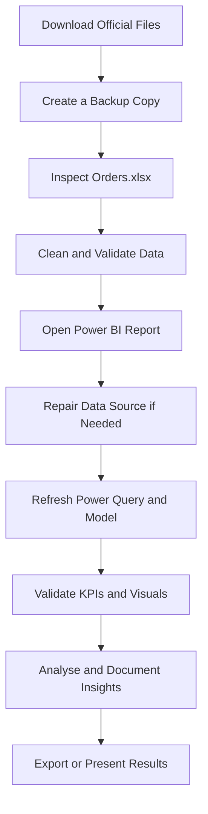

# 📘 How to Use This Sales Analytics Project

This guide explains how to use the files in **Sales Data Analysis — Assessment 11** safely and effectively for learning, portfolio development, data preparation, Power BI practice, and business analysis.

> **Project files:** `Orders.xlsx` and `eOrderid_powerbi.pbix`

---

## 📌 What This Project Is For

This repository is designed as a practical Excel-to-Power BI analytics project. It can be used to practise the complete workflow from reviewing raw order data to preparing, modelling, visualising, validating, and presenting business insights.

### Best uses

| Use case | How the project helps |
|---|---|
| Excel data review | Practise checking headers, formats, blanks, duplicates, and inconsistent values. |
| Data cleaning | Standardise text, dates, numeric fields, and category values before reporting. |
| Power Query practice | Import the workbook, transform data, assign data types, and create repeatable cleaning steps. |
| Power BI modelling | Review relationships, calculated columns, measures, and report-level logic. |
| Dashboard development | Improve visual hierarchy, filters, KPI cards, charts, navigation, and report usability. |
| Sales analysis | Explore order volume, sales trends, product or customer performance, and other available dimensions. |
| Portfolio presentation | Demonstrate an end-to-end analytics workflow using Excel and Power BI. |
| Assessment practice | Rebuild or extend the report as an academic or professional analytics exercise. |
| Scenario testing | Replace the sample records with another compatible dataset and test the refresh workflow. |
| Documentation practice | Record assumptions, data-quality decisions, KPI definitions, and analytical findings. |

> The exact analyses available depend on the columns included in `Orders.xlsx`.

---

## 🧰 Requirements

Before starting, install or prepare:

- **Microsoft Excel** or another application that can open `.xlsx` files;
- **Microsoft Power BI Desktop** for the `.pbix` report;
- enough local storage for a working copy and backup;
- trusted security software for scanning downloaded files; and
- optional Git, when cloning the complete repository.

---

## 🚀 Quick Start

### Method 1 — Clone the repository

```bash
git clone https://github.com/samusa099/sales-data-a11.git
cd sales-data-a11
```

### Method 2 — Download individual files

- [Download `Orders.xlsx`](https://github.com/samusa099/sales-data-a11/raw/main/Orders.xlsx)
- [Download `eOrderid_powerbi.pbix`](https://github.com/samusa099/sales-data-a11/raw/main/eOrderid_powerbi.pbix)

### Recommended local setup

Create a working folder and keep both project files together:

```text
sales-data-a11/
├── Orders.xlsx
├── eOrderid_powerbi.pbix
├── README.md
├── HOW_TO_USE.md
└── SECURITY.md
```

Keeping the Excel workbook and Power BI file in the same project folder makes data-source management easier.

---

## 🔄 Recommended Workflow



---

## 1️⃣ Review the Excel Dataset

Open `Orders.xlsx` before refreshing the Power BI report.

### Check the workbook structure

Confirm that:

- the intended data sheet is present;
- column headers are unique and meaningful;
- each row represents the expected level of detail;
- no merged cells interrupt the main data table;
- dates are stored as valid dates;
- quantities and monetary fields are numeric;
- categorical values use consistent spelling; and
- formulas, external links, and named ranges are understood before use.

### Run basic data-quality checks

| Check | What to look for | Recommended action |
|---|---|---|
| Blank records | Empty rows or required fields | Remove or investigate them. |
| Duplicate records | Repeated order IDs or identical rows | Confirm whether they are genuine or duplicated. |
| Invalid dates | Text dates, impossible dates, mixed formats | Convert to one consistent date format. |
| Numeric errors | Numbers stored as text, symbols inside numeric cells | Clean and convert data types. |
| Category inconsistency | Different spellings or extra spaces | Standardise values. |
| Missing identifiers | Orders without expected keys | Correct, exclude, or document them. |
| Outliers | Unusually high or negative values | Validate before keeping or removing them. |
| Hidden content | Hidden sheets, rows, columns, links, or formulas | Review before enabling refresh or reuse. |

### Preserve the source schema

The Power BI report may depend on the existing sheet name and column names. Before renaming, deleting, or changing columns:

1. save a backup of the original workbook;
2. note the existing table and sheet names;
3. check Power Query dependencies in Power BI;
4. make one controlled change at a time; and
5. refresh and validate the report after each structural change.

---

## 2️⃣ Open and Connect the Power BI Report

Open `eOrderid_powerbi.pbix` in Power BI Desktop.

### When the Excel file is found automatically

1. Select **Home → Refresh**.
2. Wait for Power Query and the data model to finish loading.
3. Review the report pages for errors or blank visuals.
4. Compare important totals with the Excel source.

### When Power BI cannot find `Orders.xlsx`

1. Open **File → Options and settings → Data source settings**.
2. Select the Excel source used by the report.
3. Choose **Change Source**.
4. Browse to your local `Orders.xlsx` file.
5. Confirm the path and apply the change.
6. Select **Home → Refresh**.

If the source still fails, open **Transform data** and inspect the first Power Query step, normally named **Source**.

---

## 3️⃣ Review Power Query

Open **Home → Transform data** and inspect each query step.

Recommended checks:

- source file path;
- selected sheet or table;
- promoted headers;
- assigned data types;
- removed or renamed columns;
- replaced values;
- filtered rows;
- merged or appended queries;
- custom columns; and
- error-handling steps.

### Best practice

Use clear step names instead of leaving many generic names such as `Changed Type1` or `Removed Columns2`. Descriptive names make the transformation workflow easier to audit and maintain.

Example:

```text
Source
Selected Orders Table
Promoted Headers
Assigned Data Types
Removed Blank Orders
Standardised Categories
Validated Numeric Fields
```

---

## 4️⃣ Validate the Data Model

In **Model view**, check:

- whether all expected tables are loaded;
- whether relationships are active and correctly directed;
- whether key fields contain duplicates or blanks;
- whether date analysis uses a suitable date field or date table;
- whether numeric fields are summarised correctly;
- whether hidden technical fields are appropriately hidden; and
- whether measure names and folders are understandable.

Avoid creating unnecessary calculated columns when a measure or Power Query transformation would be more efficient.

---

## 5️⃣ Validate the Dashboard

After refresh, review every report page.

### Visual validation checklist

- KPI cards match the source data.
- Chart totals agree with relevant Excel summaries.
- Slicers filter the expected visuals.
- Cross-filtering behaves logically.
- Titles clearly describe the metric and context.
- Units and number formats are consistent.
- Date ranges are visible where necessary.
- Blank or error states are handled cleanly.
- Visuals remain readable at normal screen size.
- Tooltips add useful information rather than repeating labels.

### Business validation checklist

For every KPI, document:

- the business definition;
- the source fields used;
- the aggregation method;
- included and excluded records;
- date logic;
- treatment of blanks, returns, or cancellations; and
- any assumptions or limitations.

---

## 📊 Analysis Ideas

Depending on the available fields, the dataset may support questions such as:

### Sales performance

- How does sales performance change over time?
- Which periods show the strongest or weakest results?
- What is the average value per order?
- Are high-value orders concentrated in a small number of records?

### Order behaviour

- How many orders are processed by period?
- Are there duplicate, cancelled, delayed, or incomplete orders?
- Which order categories contribute most to the total?

### Product analysis

- Which products or categories perform best?
- Which items show low volume but high value?
- Which categories require further review?

### Customer analysis

- Which customers contribute most to sales?
- Are repeat orders visible?
- Is performance overly dependent on a small customer group?

### Geographic or channel analysis

- Which regions, cities, branches, or channels perform best?
- Where are performance gaps or growth opportunities visible?

### Operational analysis

- Are there unusual values, missing fields, or inconsistent records?
- Which parts of the data collection process need stronger controls?

Do not claim insights that the available columns and validated data cannot support.

---

## 🧪 Ways to Extend the Project

You can improve the project by adding:

- a dedicated date table;
- documented DAX measures;
- target-versus-actual KPIs;
- month-over-month and year-over-year comparisons;
- drill-through pages;
- custom tooltip pages;
- bookmarks and navigation buttons;
- data-quality summary cards;
- a dashboard glossary;
- a KPI definition file;
- a data dictionary;
- a cleaned-data export;
- a Python or SQL validation workflow; or
- dashboard screenshots for GitHub preview.

Any extension should preserve the original files or be clearly identified as a new version.

---

## ♻️ Replacing the Sample Data

The project can be reused with another dataset only when the replacement is structurally compatible.

### Safest method

1. Make a copy of the complete project folder.
2. Keep the same Excel file name initially.
3. Keep the expected sheet, table, and column names.
4. Replace only the data rows.
5. Confirm that data types remain compatible.
6. Refresh Power BI.
7. inspect Power Query errors;
8. validate measures and report totals; and
9. save the reused version under a new project name.

### When the new dataset has different columns

Update the following carefully:

- Power Query source and transformation steps;
- renamed or removed column references;
- relationships;
- calculated columns;
- DAX measures;
- visual field assignments;
- filters, slicers, and drill-through fields; and
- documentation and KPI definitions.

---

## 🔐 Safe Usage

Before opening or refreshing the files:

- download only from the official repository;
- scan the files with trusted security software;
- review Excel formulas, external links, and connections;
- review Power BI data sources, Power Query, custom visuals, and credentials;
- never store production passwords or tokens in the project;
- do not upload private customer or company data to a public repository;
- use synthetic, anonymised, or authorised data; and
- read the full [`SECURITY.md`](SECURITY.md) policy.

---

## 🛠️ Troubleshooting

| Problem | Likely cause | Recommended fix |
|---|---|---|
| Power BI cannot find the workbook | Local file path changed | Update the source through Data source settings. |
| Refresh returns column errors | Columns were renamed, removed, or changed | Restore the expected schema or update Power Query steps. |
| Numbers do not match Excel | Different filters, data types, or aggregation logic | Compare source rows, filters, measures, and exclusions. |
| Dates do not group correctly | Invalid date type or missing date structure | Convert the field to Date and review date modelling. |
| Visual is blank | Filter context, relationship, or missing data issue | Clear filters and inspect the fields and relationships. |
| Power Query shows errors | Invalid values or incompatible transformations | Inspect the first failing step and correct the source or transformation. |
| File opens with a security warning | External content or connection detected | Do not enable it until the source and purpose are verified. |
| GitHub cannot preview the PBIX file | `.pbix` is a binary Power BI file | Download it and open it in Power BI Desktop. |

---

## ✅ Final Review Checklist

Before presenting, publishing, or submitting the project:

- [ ] Source workbook is backed up.
- [ ] Required fields have been checked for blanks and duplicates.
- [ ] Data types are correct.
- [ ] Power BI connects to the intended workbook.
- [ ] All queries refresh without errors.
- [ ] Relationships are valid.
- [ ] KPI definitions are documented.
- [ ] Dashboard totals match validated source calculations.
- [ ] Filters and interactions work correctly.
- [ ] No credentials or confidential records are included.
- [ ] File names and documentation are current.
- [ ] The final report has been reviewed at normal screen size.

---

## 📄 Important Notes

- This is an educational and portfolio-oriented analytics project.
- Validate all figures before using the report for an operational or financial decision.
- Power BI Desktop is required to open and edit the `.pbix` file.
- The report may require a local data-source path update after download.
- The available analysis is limited by the quality and structure of the source dataset.

---

## 👤 Author

**MUSA**
