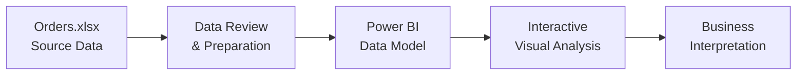

<div align="center">

# 📊 Sales Data Analysis — Assessment 11

**An Excel-to-Power BI sales analytics project for exploring order data and presenting business insights through an interactive report.**

[](https://github.com/samusa099/sales-data-a11/raw/main/Orders.xlsx)
[](https://github.com/samusa099/sales-data-a11/raw/main/eOrderid_powerbi.pbix)
[](https://github.com/samusa099/sales-data-a11)

[](LICENSE)
[](https://github.com/samusa099/sales-data-a11/commits/main)
[](https://github.com/samusa099/sales-data-a11)
[](SECURITY.md)

[Overview](#-project-overview) • [Files](#-repository-contents) • [Workflow](#-analytics-workflow) • [Usage](#-how-to-use) • [License](#-license)

</div>

---

## 🎯 Project Overview

This repository contains a compact sales analytics assessment that connects a source dataset in **Microsoft Excel** with a report developed in **Microsoft Power BI**.

The project demonstrates a practical analytics workflow:

- reviewing and organizing order-level sales data;
- preparing the dataset for reporting;
- building a Power BI data model and report;
- presenting sales information through clear, interactive visuals; and
- maintaining the supporting dataset, report file, documentation, security policy, and license in one repository.

> **Project type:** Data analytics assessment and portfolio project.

## 📁 Repository Contents

| File | Type | Purpose |
|---|---|---|
| [`Orders.xlsx`](Orders.xlsx) | Excel workbook | Source sales and order dataset used by the project. |
| [`eOrderid_powerbi.pbix`](eOrderid_powerbi.pbix) | Power BI report | Interactive report and analytics model built from the Excel dataset. |
| [`README.md`](README.md) | Documentation | Project overview, file guide, workflow, and usage instructions. |
| [`SECURITY.md`](SECURITY.md) | Security policy | Guidance for responsibly reporting security concerns. |
| [`LICENSE`](LICENSE) | MPL 2.0 | Terms governing use and distribution of the repository content. |

## 🔄 Analytics Workflow



## 🧰 Tools and Capabilities

| Area | Technology / Capability |
|---|---|
| Data source | Microsoft Excel (`.xlsx`) |
| Reporting | Microsoft Power BI Desktop (`.pbix`) |
| Data preparation | Data review, transformation, and model preparation |
| Analysis | Sales and order-level exploratory analysis |
| Visualization | Interactive charts, filters, and report views |
| Documentation | Markdown and GitHub repository documentation |

## 🚀 How to Use

### Option 1 — Download the complete repository

```bash
git clone https://github.com/samusa099/sales-data-a11.git
cd sales-data-a11
```

### Option 2 — Download the project files directly

- [⬇️ Download the Excel dataset](https://github.com/samusa099/sales-data-a11/raw/main/Orders.xlsx)
- [⬇️ Download the Power BI report](https://github.com/samusa099/sales-data-a11/raw/main/eOrderid_powerbi.pbix)

### Open and review the project

1. Open `Orders.xlsx` in Microsoft Excel to inspect the source data.
2. Open `eOrderid_powerbi.pbix` in Microsoft Power BI Desktop.
3. If Power BI cannot locate the workbook, update the data-source path to the downloaded `Orders.xlsx` file.
4. Refresh the report and use its visuals, filters, and report pages to explore the available sales information.

> Power BI files cannot be previewed directly on GitHub. Download the `.pbix` file and open it with **Power BI Desktop**.

## ✅ Recommended Review Checklist

- Confirm that column names and data types are consistent in `Orders.xlsx`.
- Check for blank, duplicate, or invalid order records before refreshing the report.
- Verify that the Power BI data-source path points to the correct local workbook.
- Refresh the model and confirm that all report visuals load correctly.
- Review filter interactions and totals before using the report for presentation or decision support.

## 🔐 Security

Please review the repository's [Security Policy](SECURITY.md) before reporting a vulnerability or security-related concern.

Do not publish credentials, private customer information, confidential company data, or other sensitive material in a public issue.

## 📄 License

This project is distributed under the **Mozilla Public License 2.0**. See the [`LICENSE`](LICENSE) file for the complete terms.

## 👤 Author

**Siam Ahmad Musa**  
GitHub: [@samusa099](https://github.com/samusa099)

---

<div align="center">

**Built for practical sales analytics learning with Excel and Power BI.**

⭐ Star the repository if the project is useful to you.

</div>
