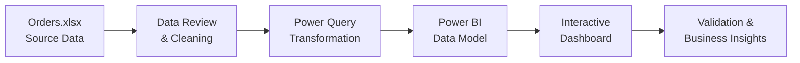

<div align="center">

# 📊 Sales Data Analysis — Assessment 11

**An Excel-to-Power BI sales analytics project for exploring order data and presenting business insights through an interactive report.**

[](https://github.com/samusa099/sales-data-a11/raw/main/Orders.xlsx)
[](https://github.com/samusa099/sales-data-a11/raw/main/eOrderid_powerbi.pbix)
[](HOW_TO_USE.md)

[](LICENSE)
[](https://github.com/samusa099/sales-data-a11/commits/main)
[](https://github.com/samusa099/sales-data-a11)
[](SECURITY.md)

[Overview](#-project-overview) • [Files](#-repository-contents) • [Best Uses](#-best-ways-to-use-this-project) • [Workflow](#-analytics-workflow) • [Usage](#-quick-start) • [Full Guide](HOW_TO_USE.md) • [Security](#-security--file-safety) • [License](#-license)

</div>

---

## 🎯 Project Overview

This repository contains a compact sales analytics assessment that connects a source dataset in **Microsoft Excel** with a report developed in **Microsoft Power BI**.

The project demonstrates a practical analytics workflow:

- reviewing and organising order-level sales data;
- preparing and validating the dataset for reporting;
- building or reviewing a Power BI data model;
- presenting sales information through interactive visuals;
- checking KPI, filter, and report accuracy; and
- documenting the project for learning and portfolio use.

> **Project type:** Data analytics assessment and portfolio project.

## 📁 Repository Contents

| File | Type | Purpose |
|---|---|---|
| [`Orders.xlsx`](Orders.xlsx) | Excel workbook | Source sales and order dataset used by the project. |
| [`eOrderid_powerbi.pbix`](eOrderid_powerbi.pbix) | Power BI report | Interactive report and analytics model built from the Excel dataset. |
| [`HOW_TO_USE.md`](HOW_TO_USE.md) | Detailed guide | Step-by-step instructions, best-use cases, validation checks, analysis ideas, reuse workflow, and troubleshooting. |
| [`README.md`](README.md) | Documentation | Project overview, file map, workflow, and quick-start instructions. |
| [`SECURITY.md`](SECURITY.md) | Security policy | Responsible disclosure, data privacy, and binary-file safety guidance. |
| [`LICENSE`](LICENSE) | MPL 2.0 | Terms governing use and distribution of the repository content. |

## 💡 Best Ways to Use This Project

| Goal | Recommended use |
|---|---|
| Learn Excel data preparation | Review headers, formats, blanks, duplicates, dates, categories, and numeric fields. |
| Practise Power Query | Inspect and improve repeatable data-cleaning and transformation steps. |
| Develop Power BI skills | Review data sources, relationships, measures, filters, visuals, and report navigation. |
| Perform sales analysis | Explore trends, order behaviour, and available product, customer, geographic, or channel dimensions. |
| Build a portfolio project | Present an end-to-end Excel-to-Power BI analytics workflow with clear documentation. |
| Complete an assessment | Rebuild, validate, improve, or explain the report as a structured analytics exercise. |
| Reuse the dashboard | Replace the sample records with a compatible dataset and carefully validate the refreshed model. |
| Improve data governance | Document KPI definitions, assumptions, data-quality issues, privacy controls, and limitations. |

> The exact analysis depends on the fields available in `Orders.xlsx`. Do not claim findings that the validated dataset cannot support.

📘 **For the complete workflow, read [`HOW_TO_USE.md`](HOW_TO_USE.md).**

## 🔄 Analytics Workflow



## 🧰 Tools and Capabilities

| Area | Technology / Capability |
|---|---|
| Data source | Microsoft Excel (`.xlsx`) |
| Reporting | Microsoft Power BI Desktop (`.pbix`) |
| Data preparation | Data review, cleaning, transformation, and validation |
| Analysis | Sales and order-level exploratory analysis |
| Modelling | Relationships, measures, calculated logic, and filter context |
| Visualisation | KPI cards, charts, filters, interactions, and report views |
| Documentation | Markdown-based usage, security, and repository guidance |

## 🚀 Quick Start

### Option 1 — Download the complete repository

```bash
git clone https://github.com/samusa099/sales-data-a11.git
cd sales-data-a11
```

### Option 2 — Download the project files directly

- [⬇️ Download the Excel dataset](https://github.com/samusa099/sales-data-a11/raw/main/Orders.xlsx)
- [⬇️ Download the Power BI report](https://github.com/samusa099/sales-data-a11/raw/main/eOrderid_powerbi.pbix)
- [📘 Open the complete usage guide](HOW_TO_USE.md)

### Open and review the project

1. Keep `Orders.xlsx` and `eOrderid_powerbi.pbix` in the same local project folder.
2. Open `Orders.xlsx` and inspect its structure, data types, blank values, duplicate records, and external connections.
3. Open `eOrderid_powerbi.pbix` in Microsoft Power BI Desktop.
4. If the report cannot locate the workbook, update the source path to the downloaded `Orders.xlsx` file.
5. Refresh Power Query and the data model.
6. Check every report page, filter, KPI, and total against the validated source data.
7. Record analytical findings, assumptions, and limitations before presenting the result.

> Power BI files cannot be previewed directly on GitHub. Download the `.pbix` file and open it with **Power BI Desktop**.

## ✅ Recommended Review Checklist

- Confirm that column names and data types are consistent in `Orders.xlsx`.
- Check for blank, duplicate, invalid, or unusually large records.
- Inspect Excel formulas, named ranges, external links, and data connections.
- Verify that the Power BI data-source path points to the correct workbook.
- Review Power Query transformations for errors or broken column references.
- Confirm that model relationships and aggregation methods are appropriate.
- Refresh the model and ensure every report visual loads correctly.
- Test slicers, cross-filtering, drill-through, and report navigation.
- Compare critical dashboard totals with validated Excel calculations.
- Confirm that no credentials, personal records, or confidential business data are included.

## 🔐 Security & File Safety

This repository distributes binary Microsoft Excel and Power BI files. Download them only from the official repository and review their connections and embedded content before using them with confidential or production data.

### Security controls and expectations

| Area | Recommended action |
|---|---|
| Download source | Use only the official `samusa099/sales-data-a11` repository. |
| Excel workbook | Review formulas, named ranges, external links, and data connections before enabling refresh. |
| Power BI report | Review Power Query sources, data-source settings, refresh credentials, and custom visuals. |
| Credentials | Never commit or share passwords, tokens, gateway credentials, or connection strings. |
| Data privacy | Use synthetic, anonymised, or properly authorised data only. |
| Local protection | Keep Excel and Power BI Desktop updated and scan downloaded files with trusted security software. |
| Reporting | Do not publish sensitive vulnerability details in a public issue. |

### Before opening or refreshing

- verify that the file was downloaded from this repository;
- keep a backup before modifying the workbook or report;
- inspect external links and queries before approving access;
- avoid entering production credentials into a public or shared copy; and
- do not replace sample data with confidential records unless the environment is properly secured.

### Reporting a security concern

Read the complete [`SECURITY.md`](SECURITY.md) policy for:

- supported repository versions;
- vulnerabilities that are in or out of scope;
- private and responsible reporting guidance;
- expected acknowledgement and triage targets;
- severity classification; and
- coordinated disclosure and remediation practices.

**Do not publish credentials, personal records, private customer information, confidential company data, or exploit details in a public GitHub issue.** Use GitHub's private vulnerability reporting option from the repository **Security** tab when available.

## 📄 License

This project is distributed under the **Mozilla Public License 2.0**. See the [`LICENSE`](LICENSE) file for the complete terms.

## 👤 Author

**MUSA**  
*HR Professional • Data Analytics Practitioner*  
Building practical, business-focused insights with Excel and Power BI.

---

<div align="center">

**Built for practical sales analytics learning with Excel and Power BI.**

⭐ Star the repository if the project is useful to you.

</div>