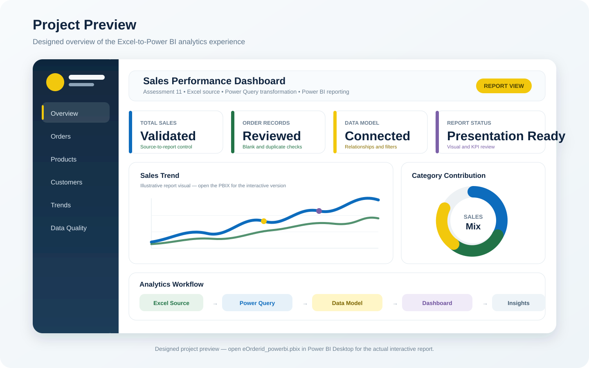
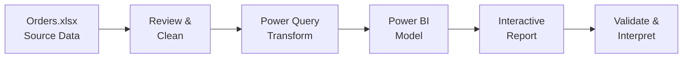

<div align="center">


<br />

<p align="center">
  <a href="https://github.com/samusa099/sales-data-a11/raw/main/Orders.xlsx">
    
  </a>
  &nbsp;
  <a href="https://github.com/samusa099/sales-data-a11/raw/main/eOrderid_powerbi.pbix">
    
  </a>
  &nbsp;
  <a href="HOW_TO_USE.md">
    
  </a>
</p>

<p align="center">
  <a href="LICENSE">
    
  </a>
  &nbsp;
  <a href="https://github.com/samusa099/sales-data-a11/commits/main">
    
  </a>
  &nbsp;
  <a href="https://github.com/samusa099/sales-data-a11">
    
  </a>
  &nbsp;
  <a href="SECURITY.md">
    
  </a>
</p>

<p align="center">
  <a href="https://github.com/samusa099/sales-data-a11/stargazers">
    
  </a>
  &nbsp;
  <a href="https://github.com/samusa099/sales-data-a11/forks">
    
  </a>
  &nbsp;
  <a href="https://github.com/samusa099/sales-data-a11/issues">
    
  </a>
  &nbsp;
  
  &nbsp;
  
</p>

**An Excel-to-Power BI sales analytics project for reviewing order data, preparing a reliable model and presenting business-focused insights.**

[Overview](#-project-overview) • [Preview](#-project-preview) • [Highlights](#-project-highlights) • [Files](#-repository-contents) • [Uses](#-best-ways-to-use-this-project) • [Workflow](#-analytics-workflow) • [Start](#-quick-start) • [Guide](HOW_TO_USE.md) • [Security](#-security--file-safety) • [Author](#-author)

</div>

---

## 🎯 Project Overview

**Sales Data Analysis — Assessment 11** is a compact portfolio and assessment project that connects an order-level dataset in **Microsoft Excel** with an analytical report in **Microsoft Power BI**.

The repository demonstrates a practical end-to-end workflow:

- reviewing and organising source data;
- identifying blanks, duplicates, invalid values and inconsistent formats;
- preparing repeatable transformations through Power Query;
- reviewing the Power BI data model, relationships and filter behaviour;
- validating report totals against the Excel source;
- presenting sales information through structured visuals; and
- documenting the project for learning, assessment and portfolio use.

> **Project category:** Data analytics assessment and portfolio demonstration.

---

## 🖥️ Project Preview

<p align="center">
  
</p>

> The visual above is a **designed project overview**, not an exported screenshot from the PBIX file. Download and open [`eOrderid_powerbi.pbix`](eOrderid_powerbi.pbix) in Microsoft Power BI Desktop to view the actual interactive report.

---

## ✨ Project Highlights

| Capability | What this project demonstrates |
|---|---|
| 📗 Excel source management | Reviewing the structure, data types, records, formulas, links and source quality of `Orders.xlsx`. |
| 🧹 Data preparation | Cleaning and standardising the source before it is used for reporting. |
| 🔄 Power Query | Building or reviewing repeatable transformation steps and repairing the local source path when required. |
| 🧩 Data modelling | Checking relationships, aggregation logic, measures, filters and model behaviour. |
| 📊 Dashboard validation | Comparing KPIs and chart totals with the validated Excel source. |
| 🧠 Business interpretation | Turning available sales and order information into clear, supportable observations. |
| 📁 Portfolio documentation | Presenting files, usage instructions, security guidance and project scope professionally on GitHub. |

---

## 📁 Repository Contents

| File | Type | Purpose |
|---|---|---|
| [`Orders.xlsx`](Orders.xlsx) | Excel workbook | Source sales and order dataset used by the project. |
| [`eOrderid_powerbi.pbix`](eOrderid_powerbi.pbix) | Power BI report | Interactive report and analytics model built from the Excel source. |
| [`HOW_TO_USE.md`](HOW_TO_USE.md) | Detailed guide | Setup, cleaning, refresh, validation, analysis, reuse and troubleshooting instructions. |
| [`assets/sales-data-cover.svg`](assets/sales-data-cover.svg) | Cover visual | Repository-native fallback cover retained with the project assets. |
| [`assets/project-preview.svg`](assets/project-preview.svg) | Preview visual | Designed overview of the intended analytics experience. |
| [`SECURITY.md`](SECURITY.md) | Security policy | Responsible disclosure, privacy and safe binary-file usage guidance. |
| [`LICENSE`](LICENSE) | MPL 2.0 | Terms governing use and distribution of the repository content. |

---

## 💡 Best Ways to Use This Project

| Goal | Recommended use |
|---|---|
| Learn Excel data preparation | Review headers, dates, numeric fields, categories, blanks, duplicates and unusual values. |
| Practise Power Query | Inspect, rename and improve repeatable transformation steps. |
| Develop Power BI skills | Review sources, relationships, measures, filters, visuals and report navigation. |
| Perform sales analysis | Explore trends, order behaviour and any product, customer, channel or geographic fields available in the source. |
| Build a portfolio case study | Present a complete Excel-to-Power BI workflow with documentation and validation controls. |
| Complete an assessment | Rebuild, explain, validate or extend the report as a structured analytics exercise. |
| Test a compatible dataset | Replace sample rows while preserving the expected schema and then validate the refreshed model. |
| Improve data governance | Document KPI definitions, assumptions, data-quality decisions, limitations and privacy controls. |

> The exact analysis depends on the fields contained in `Orders.xlsx`. Findings should not exceed what the validated data can support.

📘 Read the full [`HOW_TO_USE.md`](HOW_TO_USE.md) guide for detailed procedures and troubleshooting.

---

## 🔄 Analytics Workflow



### Recommended sequence

1. Download the official project files.
2. Create a backup working copy.
3. Review and clean `Orders.xlsx`.
4. Open `eOrderid_powerbi.pbix` in Power BI Desktop.
5. Repair the Excel source path when necessary.
6. Refresh Power Query and the data model.
7. Validate every KPI, filter and visual.
8. Document insights, assumptions and limitations.

---

## 🧰 Tools and Capabilities

| Area | Technology / Capability |
|---|---|
| Data source | Microsoft Excel (`.xlsx`) |
| Reporting | Microsoft Power BI Desktop (`.pbix`) |
| Data preparation | Data review, cleaning, transformation and validation |
| Modelling | Relationships, measures, calculated logic and filter context |
| Analysis | Sales and order-level exploratory analysis |
| Visualisation | KPI cards, charts, filters, interactions and report pages |
| Documentation | Markdown-based project, usage and security guidance |

---

## 🚀 Quick Start

### Option 1 — Clone the repository

```bash
git clone https://github.com/samusa099/sales-data-a11.git
cd sales-data-a11
```

### Option 2 — Download the main files

- [⬇️ Download `Orders.xlsx`](https://github.com/samusa099/sales-data-a11/raw/main/Orders.xlsx)
- [⬇️ Download `eOrderid_powerbi.pbix`](https://github.com/samusa099/sales-data-a11/raw/main/eOrderid_powerbi.pbix)
- [📘 Open `HOW_TO_USE.md`](HOW_TO_USE.md)

### Open and review

1. Keep `Orders.xlsx` and `eOrderid_powerbi.pbix` in the same local project folder.
2. Inspect the Excel workbook before refreshing the report.
3. Open the PBIX file in Microsoft Power BI Desktop.
4. Go to **File → Options and settings → Data source settings** if the workbook path is broken.
5. Point the report to the downloaded `Orders.xlsx` file.
6. Refresh the queries and data model.
7. Compare critical report totals with validated Excel calculations.

> GitHub cannot preview a `.pbix` file directly. It must be downloaded and opened with Power BI Desktop.

---

## ✅ Review Checklist

- [ ] The source workbook has been backed up.
- [ ] Column names and data types are consistent.
- [ ] Blank, duplicate and invalid records have been reviewed.
- [ ] Excel formulas, named ranges, links and connections are understood.
- [ ] Power BI points to the intended workbook.
- [ ] Power Query refreshes without errors.
- [ ] Model relationships and aggregation methods are appropriate.
- [ ] KPI cards and charts match validated source calculations.
- [ ] Slicers, filters and interactions work as expected.
- [ ] No credentials, personal records or confidential business data are included.

---

## 🔐 Security & File Safety

This repository distributes binary Microsoft Excel and Power BI files. Download them only from the official repository and inspect their connections and embedded content before using confidential or production data.

| Area | Recommended action |
|---|---|
| Download source | Use only the official `samusa099/sales-data-a11` repository. |
| Excel workbook | Review formulas, named ranges, external links and data connections before enabling refresh. |
| Power BI report | Review Power Query sources, data-source settings, refresh credentials and custom visuals. |
| Credentials | Never commit passwords, access tokens, gateway credentials or connection strings. |
| Data privacy | Use synthetic, anonymised or properly authorised data only. |
| Reporting | Do not publish sensitive vulnerability details in a public issue. |

Read the complete [`SECURITY.md`](SECURITY.md) policy for supported repository versions, responsible reporting, severity classification and remediation guidance.

---

## 📄 License

This project is distributed under the **Mozilla Public License 2.0**. See [`LICENSE`](LICENSE) for the complete terms.

---

## 👤 Author

**MUSA**  
*HR Professional • Data Analytics Practitioner*  
Building practical, business-focused insights with Excel and Power BI.

---

<div align="center">

### 🌟 Practical analytics. Clear documentation. Business-focused learning.

⭐ Star the repository if this project is useful to you.

</div>
